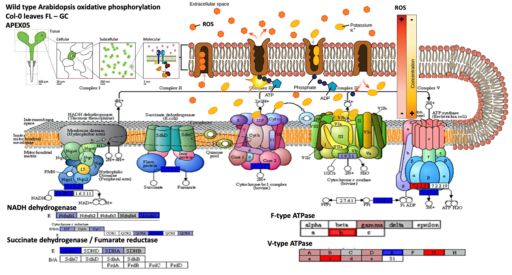

# Space-Biology-and-AstroBotany.io

This Google CoLab notebook above pulls data from the GeneLab API.

[https://github.com/dr-richard-barker/Space-Biology-and-AstroBotany.io/SDR_API_demo_viewing_html_files_in_notebook.ipynb](https://github.com/dr-richard-barker/Space-Biology-and-AstroBotany.io/blob/main/OSDR_API_demo.ipynb)

---

Preliminary analysis reveals some NASA Data files produced by the GeneLab analysis team that should be easy to open, combine and visualise. 

**Simple challenges and short-term goals to help enable analysis** 

---

**Metadata summary**

Is there a simple way to sort and summarize the meta-data? 

Is there a way to quantify the similarity of the accessions based on their metadata?

Is there a way to merge normalized counts for heatmaps?

Is there a way to merge counts for statistical analysis? 

---

**Expression data**

Is there a simple way to plot the normalised counts as a heat map?

Is there a way to view the html and other results files in the CoLab notebook?

Is there a way to view the differential expression data on Reactome pathways?

Is there a way to perform Geneset enrichment analysis of differentially expressed loci? 

Is there a way to perform PCA, K-means and T-SNE clustering to identify functionally related co-expression clusters? 

---

Images

This figure uses data projected onto a KEGG pathway that was then customised using Adobe photoshop to aid with narrative development related to changes in membrane transport. 

**Early Goal:** Test website creation methods using this early introductory repo.
Space Biology and AstroBotany.io has the goal of making space biology data more FAIR. 
